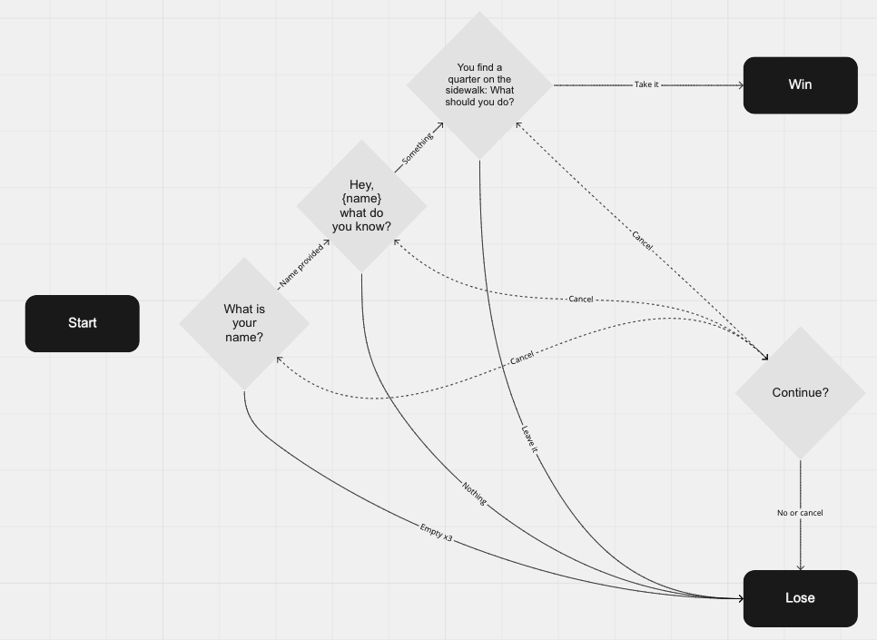

# Coding Collaboration - Session 1

##### Approximate 1 hour session

## Facilitator:

    Shawn Walcher | THE HOME DEPOT
    Software Engineer II, Space Product Team
    shawn_walcher1@homedepot.com

## The workshop will be divided into 3 primary sections:

1. Introduction (5 mins)
2. Coding (25 mins)
3. Sharing (30 mins)

## Introduction:

These workshops are intended to help participants hone our skills and see multiple ways a problem may be solved. The challenges should be simple enough to be code complete in about 25 mins. After coding we'll collaborate to review each PR and provide honest, constructive feedback.

## Goals:

- Drive engagement
  - by encouraging the team to work towards a common goal in a less formal approach to gain better understandings of each others styles.
- Diverge from the connection conundrum
  - by joining forces and moving away from our everyday silos
- Cultivate innovation
  - by encouraging paired programming, clean code practices, and more intuned code reviews
- Optimize work processes
  - by adapting to the innovations gained by joining in on these sessions

## Challenge:

Create a simple word based game without adding any additional packages. This is a JS challenge so please stay out of html/css files.
There are only 2 classes in the html win and lose. Make sure to show only the appropriate class once the game is over. Starting point is `./Code/build/challenge.js`. Feel free to change anything in this JS file and add any additional JS files you wish. No using .innerHTML (Don't want any pesky [XSS attacks](https://www.securecodewarrior.com/blog/coders-conquer-security-xss)). Remember that we will be reviewing this code as though it is a normal PR just verbally. Choose whatever pairing style works best for your team.

## Game play path Diagram:

Win Path:

- What is your name? > {name} > Hey {name} what do you know > something > You find a quarter on the sidewalk: What should you do? > take it > you win

Lose Paths:

- If user presses cancel at any > Continue? yes or no (yes, go back to question you were on) else > you lose
- If user provides no answer or an out of bounds answer e.g(I'm a winner) at any time just ask the same question again (at 3 tries) > you lose
- What is your name? > {name} > Hey {name} what do you know > nothing > you lose
- What is your name? > {name} > Hey {name} what do you know > something > You find a quarter on the sidewalk: What should you do? > leave it > you lose

## Code:

1. Clone the repo `git clone git@github.homedepot.com:sxw172p/coding-collaboration-1.git`
2. `cd` into that directory
3. Run `npm ci`
4. Run `npm start` to see your code in action
5. Starting point for your code will be `./Code/build/challenge.js`
6. Have fun

### Notes:

Facilitator will provide a branch and breakout session for each group to request their PR against. Once 25 min have elapsed each group should return to the main session.

## Sharing:

Have your PR and project ready to demo. The facilitator will choose each team to:

1. Demo your resulting project following validation below (if possible)
2. Present your PR's Files changed tab for verbal collaborative review

## Validation:

1. Load page
   - Expected: Blank page with prompt asking for name
2. Press cancel on prompt
   - Expected: Continue prompt
3. Press cancel on prompt
   - Expected: Lose screen
4. Refresh page
   - Expected: Blank page with prompt asking for name
5. Press continue on first prompt 3 times
   - Expected: Lose screen
6. Refresh page
   - Expected: Blank page with prompt asking for name
7. Respond with any name you like
   - Expected: 2nd prompt including that name
8. (Skipping additional cancel/continue validation for timeliness)
9. Respond `nothing`
   - Expected: Lose screen
10. Refresh
11. Repeat step 7
12. Fill in 2nd prompt with Something
    - Expected: 3rd prompt
13. Respond `leave it`
    - Expected: Lose screen
14. Refresh
15. Repeat steps 7 & 12
16. Respond `take it`
    - Expected: Win screen
